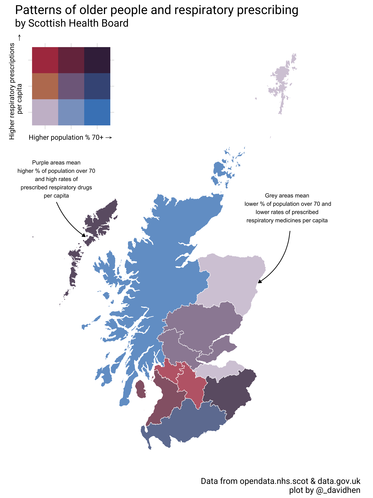
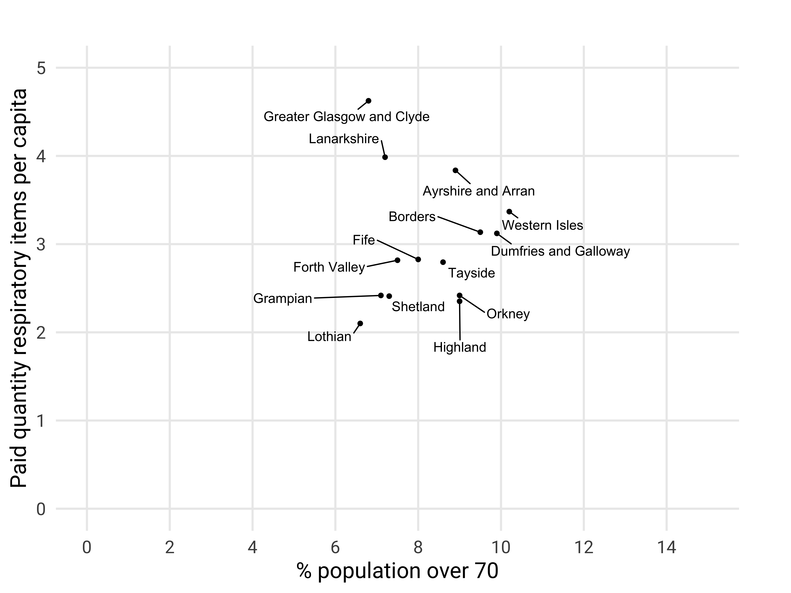

```{r setup, include=FALSE}
knitr::opts_chunk$set(echo = FALSE)
```

# Preamble

I set out here to see if it was possible to use freely-available data to map potential areas of vulnerability in Scotland given the little we do know of the Covid-19 virus. This is an edit.....

A shorter summary of this blog can be found on the Scottish Centre for Administrative Data (SCADR) website [here](https://www.scadr.ac.uk/news-and-events/blog-covid-19-vulnerability-scottish-nhs-board). This blog aims to be a bit more technical discussing the rationale and methods for calculating the plotted data. I'll also discuss the limitations of this approach. 

# The plot

This was the end product

```{r, out.width = "450px"}

```

## Why older people and respiratory medicines?

There are numerous research studies and reports showing that older people and those with chronic lung conditions have a higher susceptibility to both mortality and severe complications associated with Covid-19 [@jordan2020covid]. Other significant comorbidities include cardiovascular diseases (CVD). One cited study  [@yang2020] found that, those with serious disease were more likely to have a chronic lung condition when compared to those with mild symptoms (Odds Ratio 2.46, CI 1.76-3.44).

Importantly, these are early descriptive studies. Data isn't fully adjusted and we don't know the extent to which higher CVD or respiratory diseases are due to the age profile of severe cases. However, given the main severe complication of Covid-19 appears to be bilateral pneumonia, it seems logical that chronic lung disease will increase vulnerability. It is for this reason I chose to measure respiratory, rather than CVD, medicines.

# Methods

## Data

All the analysis data came through the excellent portal at [opendata.nhs.scot](https://www.opendata.nhs.scot/theme/isd). Specifically the [most recent (Dec 2019) prescriptions in the community file](https://www.opendata.nhs.scot/dataset/prescriptions-in-the-community), [the 2011 data zone geography codes and labels](https://www.opendata.nhs.scot/dataset/prescriptions-in-the-community), [the 2011 data zone population estimate](https://www.opendata.nhs.scot/dataset/population-estimates), and [the January 2020 GP practices and list sizes file](https://www.opendata.nhs.scot/dataset/gp-practice-contact-details-and-list-sizes/resource/a444ae58-9f8c-4447-90d8-5c8641171bb7). 


All the code used to clean and wrangle data is available in my associated [GitHub repo](https://github.com/davidhen/scot_dz_map_covid/blob/master/prescribing.Rmd). 


### Population

Population estimates were derived from the most recent data available on the portal (2018). Values of all ages for males and females were combined, and row sums of those 70 years and older calculated for denominators. 

### Prescriptions

Prescription data is only available at GP level and open data is limited in the detail it can provide. As a result the measure of respiratory medicines is crude but does show some variation across health board areas. 

The measure was calculated by adding together the total paid quantity of medicines in chapter 3 (respiratory system) of the British National Formulary (BNF) and dividing by the total population of the health board to give a per capita value. 

### Variation

Creating a quick and dirty plot of these two measures shows the percentage of the population over 70 varied from roughly 6.3% to 10.1% and the prescribing of respiratory medicines varied from just over 2 per capita to roughly 4.5 per capita.

```{r}

```

### Calculating Tertiles

To create the bi-variate key for the map, the observed range of each variable (percent of the population over 70 and number of paid respiratory items per capita) was split into tertiles (i.e three classes for each variable). By combining these variables together, a nine-class bi-variate split can be created. This process is clearly explained in [this great post](https://www.joshuastevens.net/cartography/make-a-bivariate-choropleth-map/) on the subject. 

# Results

## What does the plot tell us?

{width=30%}


With higher percentages of over 70s and higher per capita levels of respiratory prescribing, NHS Western Isles and NHS Borders appear to be the health boards with populations that may be more vulnerable to severe Covid-19 related complications. 

NHS Greater Glasgow and Clyde (GGC) and NHS Lanarkshire have high levels of respiratory prescribing overall which may also reflect greater vulnerability - however the proportion of their populations over 70 is relatively less than other areas.  

## What are the limitations?

Firstly, the plot reflects normalised data (i.e. ratios such as per capita or percent) and therefore doesn't give any idea about *absolute* numbers. Although the proportion of over 70s in NHS GGC is relatively low, it is likely there are more over 70s there than anywhere else in the country. 

The fact NHS Western Isles and Borders look the most vulnerable in the map may therefore seem insignificant. That is until you take into account the resources available to deal with severely ill patients. Routinely, there are zero (0) intensive care beds in NHS Western Isles. 

Secondly, the measure of respiratory prescriptions is a crude one and is not the most accurate picture of vulnerability. It is however, the best that I could come up with from freely-available data in a rush. The timeliness of this sort of information is important to assist in decision making. 

Ideally, I would have liked to have stratified prescriptions by age but this is not possible with  data at GP practice level. I would also have liked to have shown this measure at intermediate-level geography (smaller than local authority but bigger than datazone) to give a more local picture of vulnerability, however this proved more tricky than I anticipated so will have to spend more time on that.  

Finally, the map plot doesn't accurately show what the variation across Scotland for each measure is - something that *can* be seen in the scatter plot shown above. With a bit more time I would like to add boxplots beside the key to try and overcome this. 

## How does this fit in

Given the potential vulnerability of the population in the Western Isles [concerns raised by the local MSP](https://www.obantimes.co.uk/2020/03/18/msp-allan-raises-issue-of-air-ambulances-for-islanders-hit-by-covid-19/) about the logistics of transferring patients seem well founded. 

There have also been [concerns raised in the NHS in England](https://www.hsj.co.uk/acute-care/revealed-the-remote-and-rural-hospitals-at-threat-from-coronavirus/7027268.article) about how resources are allocated across the country, with some managers in remote and rural locations nervous about how they may cope. 

## What next?

I have individual-level prescribing data from 2016 for all individuals over the age of 65 in Scotland for another project that I am involved in. This data in stored in a secure safe haven environment and the permissions to use it do not include analysis of this type. However, we are in the process of asking for amendments to that project to enable remote access and re-purposing of the data which would enable a more accurate measure of respiratory vulnerability. 


## Acknowledgements {.appendix}

I'd like to thank Colin Angus [`@VictimOfMaths`](https://twitter.com/VictimOfMaths) for sharing his code for [another bi-variate map](https://twitter.com/victimofmaths/status/1217955193788170241?s=21) which provided the inspiration (and a good chunk of the code) for the one published here. 


